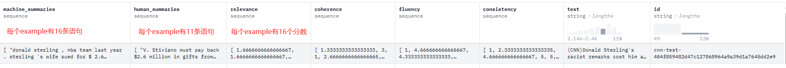
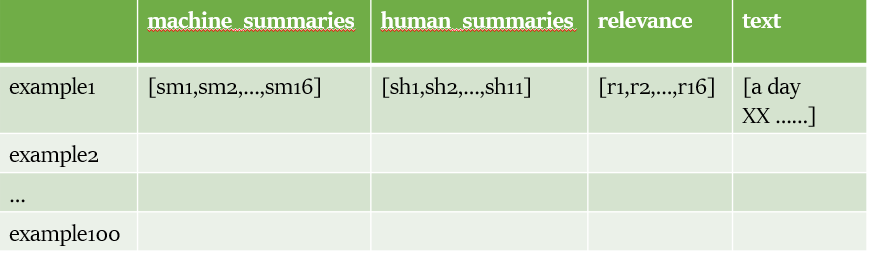

## MTEB中SummEval 任务介绍

### 数据集
1. 数据来源官方的**mteb/summeval**, 这个数据就是对于**CNN/DailyMail**原始文章给的摘要, 有通过模型生成的机器摘要, 也有通过专家和人工给出的人工摘要,并且也对这些摘要进行了评分, **人工摘要才是label**
2. 在MTEB中用的是这个数据集的`test`部分,共100条数据,并且开源的也只有test数据
3. 一个简单的**example**来了解这个任务

4. 为叙述方便,将数据集形式化定义如下：

### 数据预处理
1. 归一化 **relevance**分数, 因为后续这个分数是计算相关系数的对比一方, 归一化后的分数为human_scores  (Q: 数据有relevance coherence fluency consistency  这4个人工标注的数据指标,为什么偏偏只选relevance,难道是计算`spearman`和`pearsonr`系数需要的是相关？)

2. 将machine_summaries的所有数据提取出来,每个example是16条,共100个example, 所以一共是 1600条数据, encode后的shape为(1600,768); 同理对于human_summaries提取出来,共1100条(11句/example),encode后的shape为(1100,768)

3. 对于得到的两个embeddings,恢复为每个example的pair对,即(16,768)的machine_summaries的编码,设为 ma_emb ; (11,768)的human_summaries的编码,设为 hu_emb

### 进行指标计算
1. 从**ma_emb**中取出(1,768)的embedding为 ma_emb_1, 计算cos<ma_emb_1,hu_emb>得到cos_sim分数,shape为(1,11)

2. 对于(1,11)的cos_sim分数,取出max作为相似性

3. 遍历ma_emb得到了16个embedding, 计算后去max共得到16个分数, 设为 cos_score

4. 除了计算cos<>,还有dot<>(其实就是内积)【为了简单叙述,这个省略】

5. 遍历完所有样本, 得到共16*100长度的cos_score

6. 计算spearmanr(human_score,cos_score), pearsonr(human_score,cos_score)

### 结束

### Question
1. 根据论文[**SummEval: Re-evaluating Summarization Evaluation**](https://arxiv.org/abs/2007.12626) 没有得到我想要的信息

2. 为什么评估**text summarization**任务是这种做,违反了以前的理解,计算16个分数这里更加难以理解

3. 这个评估任务完全理解到自己固有的猜测

4. embedding不一样居然算出一样的结果, 这是什么原因

### Import Attention
1. 复现结果和原始结果有差异,一般都是复现结果差,但是有时也会结果更好。 首要分析的原因是**model**,因为在这个项目的model是预训练模型,输入单个句子和带有上下文的句子,得到的embedding不一样!所以库中使用的batch和自己一个example的处理,得到的embedding是不一样的, 结果的差异最大原因是这个!
2. 在`MTEB`的**Summeval**任务中是把1600条machine_summaries一起encode的,batch_size是32,1100条human_summaries也是一起encode,batch_size也是32,最后再恢复为原始的每个example(Why do this in such a strange processing flow confusing me a lot)
3. 换成和官方实现的方式,结果居然没有变化! 而且目前emmbedding和以前的完全不一样, 为什么还得到一样的结果,完全一样!